# Application Architecture Diagrams

**Version:** 1.0  
**Date:** December 22, 2025  
**Project:** WhatsApp Clone with E2E Encryption  

---

## 1. High-Level System Architecture

```mermaid
flowchart TB
    subgraph Clients["Client Layer"]
        WEB["🌐 Web Browser<br/>(React 18)"]
        CLI["🐍 Python CLI<br/>(whatsapp_cli.py)"]
        SDK["📦 Python SDK<br/>(WhatsAppClient)"]
    end

    subgraph Edge["Cloudflare Edge Network"]
        WORKER["⚡ Cloudflare Worker<br/>(index.ts)"]
        DO["🔄 Durable Object<br/>(ChatRoom.ts)"]
    end

    subgraph Storage["Data Layer"]
        D1[("💾 Cloudflare D1<br/>(SQLite)")]
    end

    WEB <-->|"HTTPS/WSS"| WORKER
    CLI <-->|"HTTPS/WSS"| WORKER
    SDK <-->|"HTTPS/WSS"| WORKER
    
    WORKER <-->|"RPC"| DO
    WORKER <-->|"SQL"| D1
    DO <-->|"SQL"| D1
```



---

## 2. Component Architecture


---

## 3. End-to-End Encryption Flow


---

## 4. Authentication Flow


---

## 5. Real-Time Messaging Flow

```mermaid
sequenceDiagram
    participant A as Alice
    participant DO as Durable Object
    participant B as Bob

    Note over A,DO,B: WebSocket Connection
    A->>DO: WebSocket Connect
    DO->>DO: Add to sessions map
    DO->>A: Online users list
    DO-->>B: Broadcast: Alice online

    B->>DO: WebSocket Connect
    DO->>DO: Add to sessions map
    DO-->>A: Broadcast: Bob online

    Note over A,DO,B: Send Message
    A->>A: Encrypt message (E2EE)
    A->>DO: {type: "message", to: Bob, content: encrypted}
    DO->>DO: Find Bob's session
    DO->>B: {type: "message", from: Alice, content: encrypted}
    B->>B: Decrypt message
    
    Note over A,DO,B: Message Status
    B->>DO: {type: "status", messageId, status: "delivered"}
    DO->>A: {type: "status", messageId, status: "delivered"}
    
    B->>DO: {type: "status", messageId, status: "read"}
    DO->>A: {type: "status", messageId, status: "read"}

    Note over A,DO,B: Typing Indicator
    A->>DO: {type: "typing", to: Bob, typing: true}
    DO->>B: {type: "typing", from: Alice, typing: true}
    Note right of B: Display "Alice is typing..."
    
    A->>DO: {type: "typing", to: Bob, typing: false}
    DO->>B: {type: "typing", from: Alice, typing: false}
    Note right of B: Hide typing indicator

    Note over A,DO,B: Disconnect
    A->>DO: WebSocket Close
    DO->>DO: Remove from sessions
    DO-->>B: Broadcast: Alice offline
```

---

## 6. Database Schema Diagram


---

## 7. Cryptographic Architecture


---

## 8. Python Client Architecture


---

## 9. File Structure Diagram

```mermaid
flowchart TB
    subgraph Root["📁 whatsapp-clone/"]
        direction TB
        
        subgraph Src["📁 src/"]
            subgraph Worker["📁 worker/"]
                IDX["📄 index.ts<br/>(REST API)"]
                CR["📄 ChatRoom.ts<br/>(Durable Object)"]
                TYP["📄 types.ts"]
            end
            
            subgraph Client["📁 client/"]
                APP["📄 App.tsx"]
                MAIN["📄 main.tsx"]
                subgraph Comp["📁 components/"]
                    UL["📄 UserList.tsx"]
                    CW["📄 ChatWindow.tsx"]
                    GL["📄 GroupList.tsx"]
                end
            end
        end
        
        subgraph Python["📁 python-client/"]
            subgraph PySrc["📁 src/whatsapp_client/"]
                PCLI["📄 client.py"]
                PMOD["📄 models.py"]
                subgraph PyAuth["📁 auth/"]
                    PAM["📄 manager.py"]
                end
                subgraph PyCrypto["📁 crypto/"]
                    PKEY["📄 keys.py"]
                    PX3["📄 x3dh.py"]
                    PDR["📄 double_ratchet.py"]
                end
                subgraph PyTrans["📁 transport/"]
                    PREST["📄 rest.py"]
                    PWS["📄 websocket.py"]
                end
            end
        end
        
        subgraph Docs["📁 docs/"]
            SRS["📄 SRS.md"]
            CTM["📄 CODE_TRACEABILITY_MATRIX.md"]
            ARCH["📄 ARCHITECTURE_DIAGRAMS.md"]
        end
        
        SCHEMA["📄 schema.sql"]
        WRANG["📄 wrangler.toml"]
        PKG["📄 package.json"]
    end
```



---

## 10. Request Flow Diagram


---

## 11. State Management Diagram


---

## 12. Deployment Architecture


---

## How to View These Diagrams

1. **VS Code:** Install "Markdown Preview Mermaid Support" extension
2. **GitHub:** Renders automatically in markdown preview
3. **Mermaid Live Editor:** https://mermaid.live
4. **Documentation Tools:** Docusaurus, MkDocs with mermaid plugin

---

**End of Architecture Diagrams**
